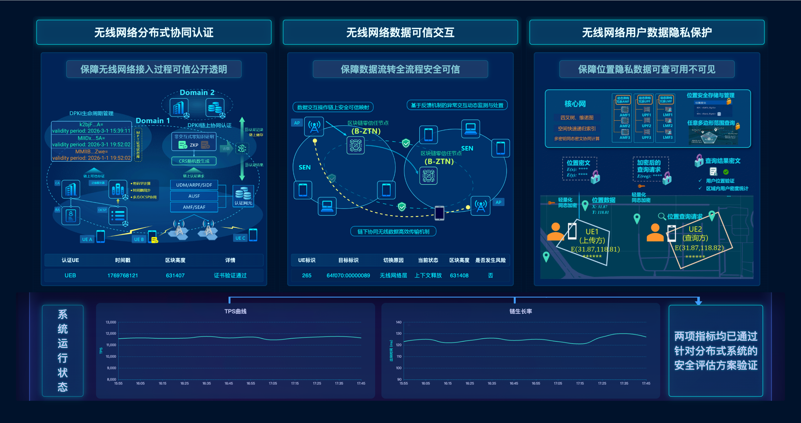

# 北邮前端

**简介**

北邮前端，根据之前的北邮大屏复现得来。最新状态（每次提交更新最新状态，图片在pic/下）：



---

## 🔧 启动方式

### 1) 可选：启动本地后端（用于左/中表格实时数据）

```bash
# 在项目根运行
./dist/bupt-api
```

默认端口为 `3001`，如需修改可设置环境变量：

```bash
PORT=4000 ./dist/bupt-api
```

> 若修改端口，请同步更新 `src/app.js` 中的 `apiBase`。

### 2) 启动前端静态服务（任选一种）

- 使用 Python（最简单）：

```bash
# 在项目根运行
python3 -m http.server 3000
# 打开浏览器
http://localhost:3000/index.html
```

- 使用 npx serve（无须额外安装）：

```bash
npx serve -s . -l 3000
```
打开浏览器访问：

```
http://localhost:3000/index.html
```

## 📁 主要文件说明

- `index.html` — 入口页面，加载 CDN 的 Vue / ElementUI / ECharts 并挂载 `/src/app.js` 与 `/src/styles.css`。
- `src/styles.css` — 全局样式（深蓝主题、荧光框、角落装饰、响应式规则）。
- `src/app.js` — Vue 逻辑（图表初始化、GIF 轮播驱动、表格数据请求与动效）。
- `dist/bupt-api` — 后端二进制（返回左/中表格所需数据，区块高度自增）。
- `assets/img/` — 图像资源（用于 banner、底图、占位图），可直接替换。
- `pic/` — 截图与效果图。
